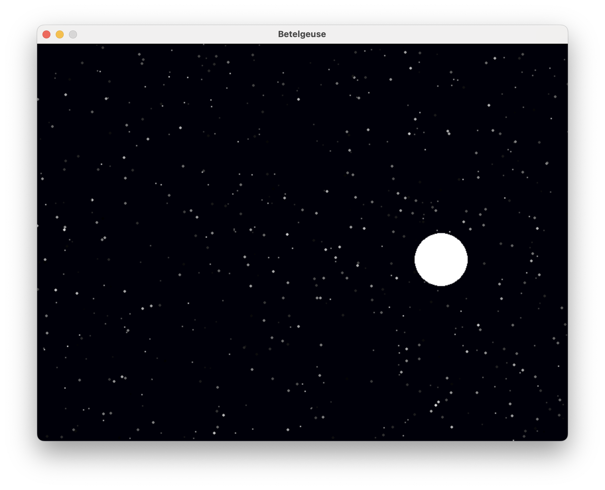

# Final Project README
Concept Description - Generated an artistic representation of the night sky from data taken from audio features within a given Spotify playlist dataset. Created stars and a moon.

Data Source & Mapping Strategy - Spotify playlist dataset created from exportify.net (Playlist: "2025" - songs I listened to in 2025). Stars were created representing each individual track within the playlist. The size of the stars was based off of the key of the track and the brightness of the star was influenced by the feature "danceability". The brightness was also updated to create the affect of the stars "twinkling". A Moon was generated based off of the average "energy" and tempo of all the tracks within the playlist. The average energy decided the position of the Moon and the average tempo affected an animation created that made the Moon rise and set.

Instructions to Run the Code - Either download my csv file "2025" and ensure in same folder as python script. Or download playlist data from exportify.net, update file path as needed, and run the code in Cursor

